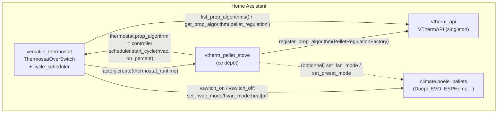
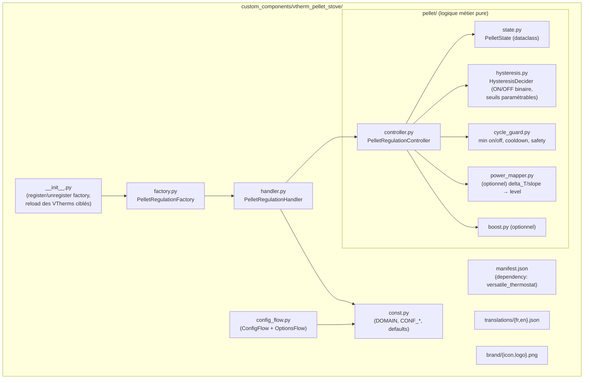
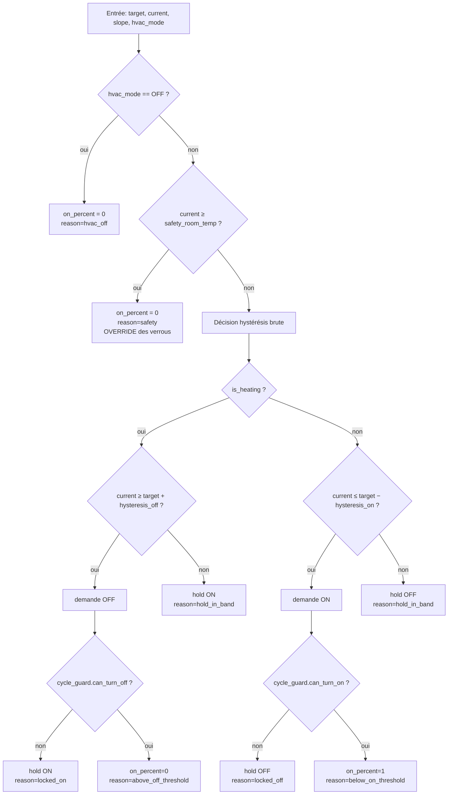
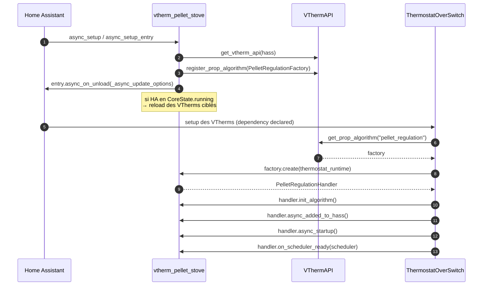
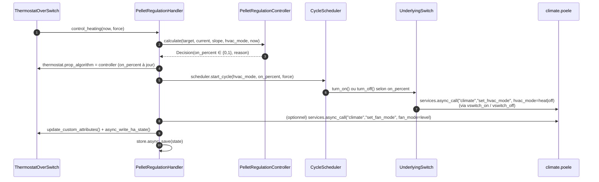
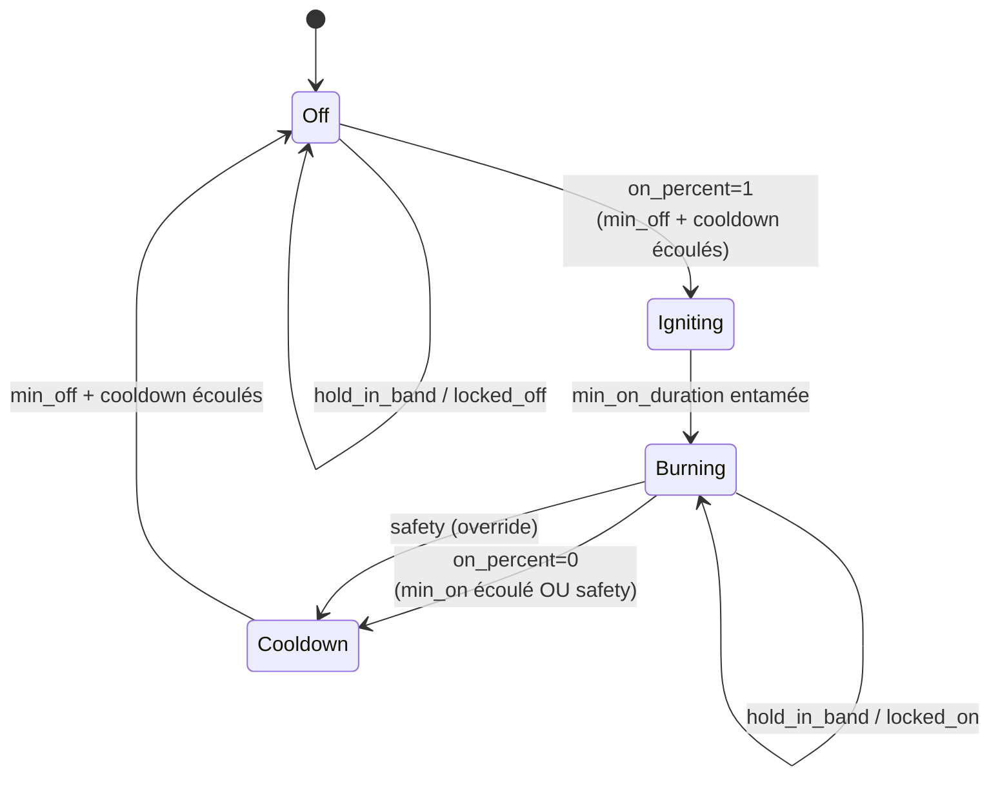
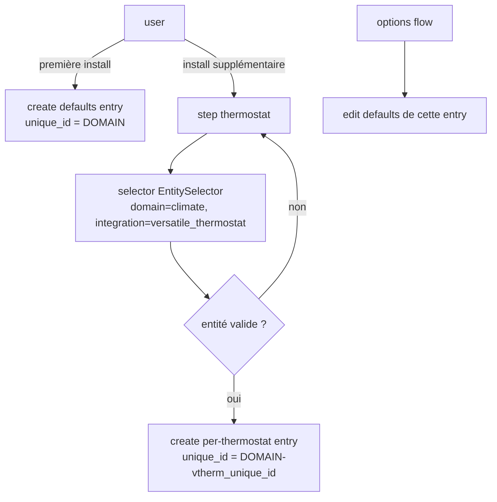

# Architecture technique - `vtherm_pellet_stove`

> Plugin externe pour **Versatile Thermostat (VTherm)** fournissant un nouvel algorithme de régulation proportionnelle nommé **`pellet_regulation`**, spécialisé pour les poêles à pellets pilotés par un VTherm en mode **`over_switch`**.
>
> Public visé : développeurs et mainteneurs du plugin.
> Statut : document d'architecture initiale (cible v0.1).
> Langue : français.

---

## 1. Objectif

Fournir une intégration Home Assistant, distribuable via HACS, qui s'enregistre auprès de l'API publique `vtherm_api` comme un nouvel **algorithme proportionnel** (`InterfacePropAlgorithmFactory`), au même titre que `tpi`, [`hysteresis`](../../vtherm_hysteresis/) ou [`smartpi`](../../vtherm_smartpi/).

L'utilisateur configure un VTherm en mode **`over_switch`** dont l'entité sous-jacente est l'entité `climate.<poele>` exposée par une intégration tierce (par exemple [`Duepi_EVO`](../../Duepi_EVO/), une intégration ESPHome, MCZ, EdilKamin, …). VTherm pilote cette entité grâce aux commandes `vswitch_on` / `vswitch_off` (par exemple `set_hvac_mode/hvac_mode:heat` et `set_hvac_mode/hvac_mode:off`).

Le plugin fournit l'algorithme `pellet_regulation` qui calcule à chaque cycle un `on_percent ∈ {0, 1}` — comme un hystérésis — mais en **respectant les contraintes physiques d'un poêle à pellets** :

- temps d'allumage et d'extinction longs (plusieurs minutes),
- nombre de cycles marche/arrêt à minimiser,
- inertie thermique forte (rayonnement + convection),
- éventuellement choix d'un **niveau de puissance** (P1..P5) via `fan_mode`/`preset_mode` du climat sous-jacent,
- températures de sécurité (surchauffe ambiante).

Le plugin reste un **module HACS autonome**, calqué sur la structure de [`vtherm_hysteresis`](../../vtherm_hysteresis/) (squelette de référence) et [`vtherm_smartpi`](../../vtherm_smartpi/) (découpage interne avancé).

---

## 2. Justification du choix `over_switch` + algorithme proportionnel

### 2.1 Pourquoi `over_switch` plutôt que `over_climate` ?

| Critère | `over_climate` | **`over_switch`** _(retenu)_ |
|---|---|---|
| Cohérence avec l'API VTherm publique | Pas de point d'extension officiel pour la régulation (objet interne `PITemperatureRegulator`). | Point d'extension officiel : `InterfacePropAlgorithmFactory` (déjà utilisé par `tpi`, `hysteresis`, `smartpi`). |
| Sémantique | Ambiguë : on pilote un `climate` mais on ré-implémente une régulation locale qui doublonne celle de VTherm. | Claire : VTherm orchestre le cycle ON/OFF via le `cycle_scheduler`. Le plugin fournit uniquement le **calcul proportionnel** spécialisé pellet. |
| Pilotage d'un `climate` sous-jacent | Géré par VTherm via `UnderlyingClimate` (synchro `set_temperature`, `set_hvac_mode`, etc.). | Géré par VTherm via `UnderlyingSwitch` qui supporte n'importe quel domaine HA (`switch`, `climate`, …) grâce aux commandes paramétrables `vswitch_on`/`vswitch_off`. |
| Cycle anti-court-cycle | À ré-implémenter. | Déjà fourni par VTherm (`minimal_activation_delay`, `minimal_deactivation_delay`, `cycle_min`). |
| Effort d'intégration | Modifications nécessaires dans `vtherm_api` et `versatile_thermostat`. | **Aucune modification** des dépôts amont. Le plugin est purement additif. |

### 2.2 Comment `over_switch` peut-il piloter un `climate` ?

L'`UnderlyingSwitch` de VTherm utilise `entity_id.split(".")[0]` pour déterminer le domaine cible et appelle `hass.services.async_call(domain, command, data)`. Les options `CONF_VSWITCH_ON_CMD_LIST` et `CONF_VSWITCH_OFF_CMD_LIST` permettent de surcharger la commande par défaut (`turn_on`/`turn_off`) avec un format `command[/argument[:value]]`. Pour un poêle :

- `vswitch_on  = "set_hvac_mode/hvac_mode:heat"`
- `vswitch_off = "set_hvac_mode/hvac_mode:off"`

VTherm appelle alors `climate.set_hvac_mode(entity_id=..., hvac_mode="heat")` quand le `cycle_scheduler` veut allumer, et l'inverse pour éteindre. Cf. [`underlyings.py`](../../versatile_thermostat/custom_components/versatile_thermostat/underlyings.py#L449) (`build_command`).

### 2.3 Pilotage du **niveau de puissance** (fan_mode / preset)

Le `cycle_scheduler` ne pilote que ON/OFF. Le réglage du niveau de puissance reste sous la responsabilité du **handler** du plugin, qui appelle directement `climate.set_fan_mode` ou `climate.set_preset_mode` sur l'entité sous-jacente. Cette opération est :

- **optionnelle** (désactivable via `power_control_enabled = false`),
- limitée à un appel **quand le niveau calculé change** (anti-spam),
- découplée de l'on/off (le poêle reçoit son niveau pendant qu'il chauffe).

L'entité sous-jacente est récupérée via `thermostat.entry_infos[CONF_UNDERLYING_LIST]` (voir §9).

---

## 3. Périmètre fonctionnel

### 3.1 Doit faire (MUST)

1. S'enregistrer comme `InterfacePropAlgorithmFactory` de nom **`pellet_regulation`** dans `VThermAPI`.
2. Fournir un `InterfacePropAlgorithmHandler` qui :
   - calcule un `on_percent ∈ {0, 1}` à partir d'une **hystérésis paramétrable** sur la température,
   - pose ce `on_percent` sur `thermostat.prop_algorithm`,
   - délègue au `cycle_scheduler` la traduction en marche/arrêt réelle (`scheduler.start_cycle(...)`).
3. Implémenter les **garde-fous spécifiques pellet** au-dessus de l'hystérésis :
   - durée minimale de marche `min_on_duration_min` (ex. 30 min),
   - durée minimale d'arrêt `min_off_duration_min` (ex. 20 min),
   - température ambiante de sécurité `safety_room_temp` (force OFF immédiat),
   - délai de cooldown `cooldown_duration_min` ajouté au `min_off_duration_min` après un OFF.
4. Optionnellement, piloter le **niveau de puissance** (`fan_mode` ou `preset_mode`) du climat sous-jacent en fonction de `delta_T` et `slope`.
5. Persister son état entre redémarrages HA (`Store(version, key)`).
6. Exposer ses paramètres via :
   - une entrée **globale** (defaults plugin),
   - une entrée **par thermostat cible** (overrides), comme `vtherm_hysteresis`.
7. Recharger les VTherms ciblés quand les options changent.
8. Fournir traductions FR/EN, manifest HACS, brand assets.

### 3.2 Pourrait faire (SHOULD)

- Boost temporaire (max_power) après changement de consigne ↑.
- Anticipation d'extinction par exploitation de `last_temperature_slope`.
- Apprentissage simple `delta_T/min` par niveau (cf. inspiration `ab_estimator` de `vtherm_smartpi`).
- Diagnostics HA (`async_get_config_entry_diagnostics`).
- Capteur `sensor.<vtherm>_pellet_state` reflétant l'état interne (Off/Igniting/Burning/Cooldown).

### 3.3 Hors périmètre (WON'T)

- Communication directe avec un poêle particulier (le plugin pilote n'importe quelle entité `climate` HA déjà installée).
- Modification de `vtherm_api` ou `versatile_thermostat`.
- Support d'`over_climate` ou `over_valve`.
- Pilotage en TPI proportionnel temporel (le poêle n'aime pas le hachage : `on_percent` est binaire).

---

## 4. Contexte et dépendances

### 4.1 Dépôts voisins

| Dépôt | Rôle |
|---|---|
| [`vtherm_api`](../../vtherm_api/) | Interfaces publiques (`InterfacePropAlgorithmFactory`, `InterfacePropAlgorithmHandler`, `InterfaceThermostatRuntime`, `InterfaceCycleScheduler`). |
| [`versatile_thermostat`](../../versatile_thermostat/) | Cœur VTherm (référence : `ThermostatOverSwitch`, `UnderlyingSwitch`, `cycle_scheduler.py`). |
| [`vtherm_hysteresis`](../../vtherm_hysteresis/) | **Squelette officiel** à cloner et adapter (factory, handler, config flow, persistance, reload). |
| [`vtherm_smartpi`](../../vtherm_smartpi/) | Référence d'un plugin avancé (sous-paquet `smartpi/`, callbacks de cycle, diagnostics). |
| [`Duepi_EVO`](../../Duepi_EVO/) | Exemple concret de `climate.poele` ciblable (`hvac_modes=[OFF, HEAT]`, `fan_modes=["1".."5"]`, `set_temperature`). |

### 4.2 Dépendances HA / Python

- `homeassistant.components.climate`
- `homeassistant.config_entries`, `homeassistant.helpers.selector`
- `homeassistant.helpers.storage.Store`
- `vtherm_api` (PyPI ou éditable en dev)
- `manifest.json` :
  ```json
  "dependencies": ["versatile_thermostat"]
  ```

---

## 5. Architecture d'ensemble

### 5.1 Vision macroscopique



### 5.2 Composants internes



### 5.3 Arborescence cible

```
vtherm_pellet_stove/
├── custom_components/
│   └── vtherm_pellet_stove/
│       ├── __init__.py
│       ├── manifest.json
│       ├── config_flow.py
│       ├── const.py
│       ├── factory.py
│       ├── handler.py
│       ├── pellet/
│       │   ├── __init__.py
│       │   ├── controller.py
│       │   ├── state.py
│       │   ├── hysteresis.py
│       │   ├── cycle_guard.py
│       │   ├── power_mapper.py
│       │   └── boost.py
│       ├── translations/{en,fr}.json
│       └── brand/{icon,logo}.png
├── documentation/{en,fr}/{vtherm_pellet_stove,technical_doc}.md
├── tests/
│   ├── conftest.py
│   ├── test_hysteresis.py
│   ├── test_cycle_guard.py
│   ├── test_controller.py
│   ├── test_power_mapper.py
│   ├── test_handler.py
│   └── test_config_flow.py
├── tech-docs/plugin-architecture.md   (ce document)
├── hacs.json
├── pyproject.toml
├── requirements_{dev,test}.txt
├── README.md / README.fr.md
├── CHANGELOG.md
└── LICENSE
```

---

## 6. Modèle de données

### 6.1 Configuration

#### 6.1.1 Hystérésis (paramétrable)

| Clé | Type | Défaut | Description |
|---|---|---|---|
| `hysteresis_on` | float (°C) | 0.5 | Démarrage si `current_temp ≤ target − hysteresis_on`. |
| `hysteresis_off` | float (°C) | 0.3 | Extinction si `current_temp ≥ target + hysteresis_off`. |
| `min_on_percent` | float [0..1] | 0.0 | Sortie quand l'algorithme demande OFF. |
| `max_on_percent` | float [0..1] | 1.0 | Sortie quand l'algorithme demande ON. |

> Les bornes de saisie (`min`, `max`, `step`) sont définies dans le `config_flow` (cf. §10), strictement à l'image de [`vtherm_hysteresis/config_flow.py`](../../vtherm_hysteresis/custom_components/vtherm_hysteresis/config_flow.py).

#### 6.1.2 Garde-fous pellet

| Clé | Type | Défaut | Description |
|---|---|---|---|
| `min_on_duration_min` | int (min) | 30 | Durée minimale de marche avant extinction autorisée. |
| `min_off_duration_min` | int (min) | 20 | Durée minimale d'arrêt avant rallumage. |
| `cooldown_duration_min` | int (min) | 5 | Délai d'observation après ordre OFF, ajouté à `min_off_duration_min`. |
| `safety_room_temp` | float (°C) | 26.0 | Température ambiante au-delà de laquelle OFF immédiat (override des verrous temporels). |

#### 6.1.3 Pilotage de puissance (optionnel)

| Clé | Type | Défaut | Description |
|---|---|---|---|
| `power_control_enabled` | bool | true | Active le pilotage du niveau de puissance. |
| `power_control_attribute` | enum | `fan_mode` | `fan_mode` ou `preset_mode` selon le poêle. |
| `power_levels` | list[str] | `["1","2","3","4","5"]` | Liste ordonnée des valeurs admissibles (du plus faible au plus fort). |
| `power_default_level_index` | int | 2 | Index par défaut quand on allume sans info de pente. |
| `power_boost_enabled` | bool | true | Active le boost (max) après changement de consigne. |
| `power_boost_duration_min` | int | 15 | Durée du boost. |

#### 6.1.4 Identification

| Clé | Type | Description |
|---|---|---|
| `target_vtherm_unique_id` | str | Unique ID du VTherm cible (entrée per-thermostat) ou absent (entrée globale). |

### 6.2 État persistant (`Store`)

Sérialisé sous la clé `vtherm_pellet_stove.<slug_thermostat>` :

```json
{
  "is_heating": true,
  "current_level_index": 2,
  "last_on_at": "2026-01-15T19:32:11+01:00",
  "last_off_at": "2026-01-15T17:02:00+01:00",
  "last_reason": "below_on_threshold",
  "boost_until": null
}
```

### 6.3 Attributs exposés sur le VTherm

```jsonc
{
  "pellet_regulation": {
    "is_heating": true,
    "on_percent": 1.0,
    "current_level": "3",
    "elapsed_on_min": 42,
    "elapsed_off_min": 0,
    "next_action_allowed_at": "2026-01-15T20:02:00+01:00",
    "last_reason": "below_on_threshold",
    "boost_active": false,
    "hysteresis_on": 0.5,
    "hysteresis_off": 0.3
  }
}
```

---

## 7. Algorithme de régulation

### 7.1 Vue d'ensemble



### 7.2 Pseudo-code

```python
def calculate(target, current, slope, hvac_mode, now, state):
    # Mode OFF du VTherm
    if hvac_mode == OFF:
        state.is_heating = False
        return Decision(on_percent=min_on_percent, reason="hvac_off")

    # Sécurité (override des garde-fous temporels)
    if current is not None and current >= safety_room_temp:
        if state.is_heating:
            state.is_heating = False
            state.last_off_at = now
        return Decision(on_percent=min_on_percent, reason="safety", force=True)

    # Hystérésis paramétrable (seuils configurables)
    if state.is_heating:
        wants_off = current is not None and current >= target + hysteresis_off
        decision = "OFF" if wants_off else "ON"
    else:
        wants_on = current is not None and current <= target - hysteresis_on
        decision = "ON" if wants_on else "OFF"

    reason = None

    # Garde-fous pellet (anti-court-cycle)
    if decision == "OFF" and state.is_heating:
        if not cycle_guard.can_turn_off(now, state):
            decision = "ON"
            reason = "locked_on"
    elif decision == "ON" and not state.is_heating:
        if not cycle_guard.can_turn_on(now, state):
            decision = "OFF"
            reason = "locked_off"

    if decision == "ON":
        if not state.is_heating:
            state.last_on_at = now
        state.is_heating = True
        return Decision(on_percent=max_on_percent,
                        reason=reason or "below_on_threshold")
    else:
        if state.is_heating:
            state.last_off_at = now
        state.is_heating = False
        return Decision(on_percent=min_on_percent,
                        reason=reason or "above_off_threshold")
```

### 7.3 Garde-fous (`CycleGuard`)

```python
class CycleGuard:
    def can_turn_off(self, now, state) -> bool:
        if state.last_on_at is None:
            return True
        elapsed_min = (now - state.last_on_at).total_seconds() / 60
        return elapsed_min >= self.min_on_duration_min

    def can_turn_on(self, now, state) -> bool:
        if state.last_off_at is None:
            return True
        elapsed_min = (now - state.last_off_at).total_seconds() / 60
        return elapsed_min >= (self.min_off_duration_min + self.cooldown_duration_min)
```

> La sécurité haute (`safety_room_temp`) **outrepasse** `can_turn_off`.

### 7.4 Pilotage de la puissance (optionnel)

Indépendant du calcul d'`on_percent`. Calculé en parallèle dans le handler, appliqué via `hass.services.async_call("climate", "set_fan_mode" | "set_preset_mode", {entity_id, fan_mode|preset_mode: value})` sur les underlyings climate récupérés depuis `entry_infos`.

Mapping par défaut (table éditable dans le code, exposable plus tard en option) :

| `delta_T = target − current` | `slope` (°C/h) | Index niveau |
|---|---|---|
| ≥ +2.0 | n'importe | dernier (max) |
| +1.0 .. +2.0 | < +0.3 | avant-dernier |
| +1.0 .. +2.0 | ≥ +0.3 | médian sup. |
| +0.3 .. +1.0 | < +0.2 | médian |
| +0.3 .. +1.0 | ≥ +0.2 | médian inf. |
| -0.3 .. +0.3 | n'importe | premier (min) |
| < -0.3 | n'importe | aucun (poêle OFF de toute façon) |

Le niveau effectif est `power_levels[index]`. Aucun appel n'est émis si la valeur courante est déjà la bonne (lecture du state HA de l'entité poêle).

### 7.5 Boost (optionnel)

Si `power_boost_enabled` et que la consigne VTherm augmente (`Δtarget ≥ 0.5°C`) → bascule sur `power_levels[-1]` pendant `power_boost_duration_min`. À expiration, retour au mapping standard. Implémentation : champ `boost_until` dans `PelletState`.

---

## 8. Flux d'exécution

### 8.1 Démarrage HA



### 8.2 Cycle de régulation



### 8.3 Diagramme d'états



> Igniting/Burning/Cooldown sont des **vues** dérivées du tuple (`is_heating`, `last_on_at`, `last_off_at`). Le cycle scheduler de VTherm gère lui-même la temporalité réelle de l'underlying.

---

## 9. Contrats `vtherm_api` utilisés

| Symbole | Usage |
|---|---|
| `VThermAPI.register_prop_algorithm(factory)` | Enregistrement avec `factory.name == "pellet_regulation"`. |
| `VThermAPI.unregister_prop_algorithm(name)` | Au `async_unload_entry` quand plus aucune entry. |
| `InterfacePropAlgorithmFactory` | Implémenté par `PelletRegulationFactory`. |
| `InterfacePropAlgorithmHandler` | Implémenté par `PelletRegulationHandler`. |
| `InterfaceThermostatRuntime` | Source : `target_temperature`, `current_temperature`, `last_temperature_slope`, `vtherm_hvac_mode`, `entry_infos`, `hass`, `cycle_scheduler`, `is_device_active`. |
| `InterfaceCycleScheduler` | Pilotage on/off : `start_cycle(hvac_mode, on_percent, force)`. Callbacks `register_cycle_start_callback` / `register_cycle_end_callback` posés (utiles pour mesure de puissance réalisée plus tard). |

### 9.1 Contrat exposé sur `thermostat.prop_algorithm`

VTherm interroge `prop_algorithm` ailleurs dans son code (safety manager). Le contrôleur expose à minima :

```python
class PelletRegulationController:
    @property
    def on_percent(self) -> float: ...
    @property
    def calculated_on_percent(self) -> float: return self.on_percent
    def calculate(self, target_temp, current_temp, *_a, **_kw) -> float: ...
    def restore_state(self, data) -> None: ...
    def save_state(self) -> dict: ...
    async def on_cycle_started(self, on_time_sec, off_time_sec, on_percent, hvac_mode) -> None: ...
    async def on_cycle_completed(self, e_eff=None, elapsed_ratio=1.0, cycle_duration_min=None, **_kw) -> None: ...
```

Modèle calqué sur [`HysteresisController`](../../vtherm_hysteresis/custom_components/vtherm_hysteresis/hysteresis/controller.py).

### 9.2 Récupération de l'entité poêle pour `set_fan_mode`

Depuis `thermostat.entry_infos[CONF_UNDERLYING_LIST]` (clé exposée par VTherm pour `over_switch`). On filtre les entity_id du domaine `climate`. Si plusieurs, on agit sur **toutes**.

---

## 10. Configuration UI (`config_flow`)

### 10.1 Étapes



### 10.2 Schéma options

Un seul schéma factorisé (`build_options_schema`), réutilisé par l'entrée globale, par l'entrée per-thermostat et par l'options flow (modèle [`vtherm_hysteresis/config_flow.py`](../../vtherm_hysteresis/custom_components/vtherm_hysteresis/config_flow.py)). Chaque champ du §6.1 a un `selector` adapté :

- `hysteresis_on` / `hysteresis_off` : `NumberSelector(min=0.0, max=5.0, step=0.01)`
- `min_on_percent` / `max_on_percent` : `NumberSelector(min=0.0, max=1.0, step=0.01)`
- `min_on_duration_min` / `min_off_duration_min` / `cooldown_duration_min` / `power_boost_duration_min` : `NumberSelector(mode=BOX, min=0, max=240, step=1)`
- `safety_room_temp` : `NumberSelector(min=15, max=40, step=0.1)`
- `power_control_enabled` / `power_boost_enabled` : `BooleanSelector`
- `power_control_attribute` : `SelectSelector(options=["fan_mode","preset_mode"])`
- `power_levels` : `TextSelector(multiple=true)` ou `ObjectSelector` (liste de chaînes)
- `power_default_level_index` : `NumberSelector(min=0, max=10, step=1)`

### 10.3 Recharge des VTherms

Identique à `_reload_hysteresis_vtherms` :

- itérer sur les entries du domaine `versatile_thermostat`,
- filtrer celles dont `CONF_PROP_FUNCTION == "pellet_regulation"`,
- si entry plugin per-thermostat → ne recharger que celui dont `unique_id` correspond,
- si entry plugin globale → recharger tous les VTherms ciblés sauf overrides per-thermostat,
- exécuté seulement si `hass.state == CoreState.running`.

### 10.4 Apparition dans le `config_flow` de VTherm

VTherm liste dynamiquement les algorithmes via `api.list_prop_algorithms()` (cf. [`config_schema.py`](../../versatile_thermostat/custom_components/versatile_thermostat/config_schema.py#L46)). Aucune action côté plugin au-delà de l'enregistrement de la factory : `pellet_regulation` apparaît dans la liste déroulante `proportional_function` du VTherm `over_switch`.

---

## 11. Stratégie de tests

### 11.1 Niveaux

| Niveau | Cible | Outils |
|---|---|---|
| Unitaire | `HysteresisDecider`, `CycleGuard`, `PowerMapper`, `PelletState`, `PelletRegulationController.calculate` | `pytest`, sans HA. |
| Intégration handler | `PelletRegulationHandler` avec faux `InterfaceThermostatRuntime` + faux `InterfaceCycleScheduler` | `pytest`, `unittest.mock`. |
| Config flow | Scénarios global / per-thermostat / options / erreurs | `pytest-homeassistant-custom-component`. |

### 11.2 Scénarios fonctionnels minimaux

1. `current ≤ target − hysteresis_on` → `on_percent = max_on_percent`, `reason = below_on_threshold`.
2. `current ≥ target + hysteresis_off` après `min_on_duration` écoulée → `on_percent = 0`, `reason = above_off_threshold`.
3. Même condition mais `min_on_duration` non écoulée → `on_percent = max_on_percent`, `reason = locked_on`.
4. `current < target − hysteresis_on` mais `min_off_duration + cooldown` non écoulés → `on_percent = 0`, `reason = locked_off`.
5. `current ≥ safety_room_temp` → `on_percent = 0`, `reason = safety`, override des verrous.
6. `hvac_mode == OFF` → `on_percent = 0`, `reason = hvac_off`.
7. Hystérésis modifiés via options flow → reload + nouvelles valeurs prises en compte.
8. Pilotage de puissance : `delta_T = +1.5, slope = +0.1` → niveau choisi = avant-dernier ; appel `set_fan_mode` une seule fois.
9. Boost : changement de consigne ↑ → `power_levels[-1]` pendant `power_boost_duration_min`.
10. Restart HA pendant `is_heating=True` → `Store` restauré + reprise cohérente.

### 11.3 CI

GitHub Actions calqué sur [`vtherm_hysteresis/.github/workflows`](../../vtherm_hysteresis/.github/) : lint, tests + coverage, validation HACS, validation manifest, release sur tag.

---

## 12. Liste des tâches

### 12.1 Sprint 0 — Squelette

- [ ] `pyproject.toml`, `requirements_{dev,test}.txt`, `hacs.json`, `LICENSE`, `README{,.fr}.md`, `CHANGELOG.md`.
- [ ] `manifest.json` (domain `vtherm_pellet_stove`, dependency `versatile_thermostat`, version `0.0.1`).
- [ ] `const.py` :
  - `DOMAIN = "vtherm_pellet_stove"`
  - `PROP_FUNCTION_PELLET_REGULATION = "pellet_regulation"`
  - toutes les clés `CONF_*` du §6.1 + `DEFAULT_OPTIONS`.
- [ ] `__init__.py` (register/unregister factory + reload).
- [ ] `factory.py` (`PelletRegulationFactory`, `name = "pellet_regulation"`).
- [ ] `handler.py` (lifecycle minimal, no-op de calcul).
- [ ] `translations/{en,fr}.json` (titres + champs).
- [ ] `brand/{icon,logo}.png` (placeholders).
- [ ] CI GitHub Actions (lint, tests, hacs validate).

### 12.2 Sprint 1 — Logique métier

- [ ] `pellet/state.py` (dataclass `PelletState`, `restore_state`/`save_state`).
- [ ] `pellet/hysteresis.py` (`HysteresisDecider` ON/OFF binaire avec `hysteresis_on/off` paramétrables).
- [ ] `pellet/cycle_guard.py` (`can_turn_on`, `can_turn_off`, sécurité override).
- [ ] `pellet/power_mapper.py` (table mapping + `choose_level_index`).
- [ ] `pellet/boost.py`.
- [ ] `pellet/controller.py` (orchestration §7, expose contrat `prop_algorithm`).
- [ ] Tests unitaires couvrant scénarios §11.2 (1..6, 8, 9).

### 12.3 Sprint 2 — Intégration HA

- [ ] Compléter `handler.py` :
  - `init_algorithm` : lecture config effective, instanciation controller, `Store`.
  - `async_added_to_hass` : restore.
  - `async_startup` : `on_state_changed(True)`.
  - `on_scheduler_ready` : mémoriser le scheduler + register cycle callbacks (no-op v0.1).
  - `control_heating` :
    1. appel `controller.calculate(...)`,
    2. `scheduler.start_cycle(hvac_mode, on_percent, force)`,
    3. (si `power_control_enabled`) `set_fan_mode/set_preset_mode` sur underlying climate,
    4. `update_custom_attributes`, `async_write_ha_state`, `store.async_save`.
  - `should_publish_intermediate`, `remove`.
- [ ] `config_flow.py` (ConfigFlow + OptionsFlow, schéma factorisé).
- [ ] Tests handler + config flow (scénarios 7 et 10).

### 12.4 Sprint 3 — Documentation & release

- [ ] `documentation/{en,fr}/vtherm_pellet_stove.md` (utilisateur, exemple complet `over_switch` + `vswitch_on/off`).
- [ ] `documentation/{en,fr}/technical_doc.md` (synthèse de ce document).
- [ ] `README{,.fr}.md` (badge HACS, schéma simple, install, lien docs).
- [ ] `CHANGELOG.md` 0.1.0.
- [ ] Tag + publication HACS.

### 12.5 Backlog (post-v0.1)

- [ ] Diagnostics HA.
- [ ] Apprentissage adaptatif `delta_T/min` par niveau.
- [ ] Détection d'erreur poêle (`unavailable`, `error`, alarmes).
- [ ] Capteur dérivé `sensor.<vtherm>_pellet_state`.
- [ ] Carte Lovelace (sur le modèle de [`vtherm_smartpi/cards`](../../vtherm_smartpi/cards/)).

---

## 13. Risques et points d'attention

| Risque | Impact | Mitigation |
|---|---|---|
| Le `cycle_scheduler` peut générer du hachage si `cycle_min` est court alors que `on_percent ∈ {0,1}`. | Court-cycles destructeurs. | Documenter `cycle_min ≥ min_on_duration_min + min_off_duration_min` dans le `README`. Garde-fous internes empêchent quand même les bascules. |
| L'utilisateur configure mal `vswitch_on/off`. | Le poêle ne réagit pas. | Documenter explicitement `set_hvac_mode/hvac_mode:heat` et `set_hvac_mode/hvac_mode:off`. Fournir un exemple complet dans `documentation/`. |
| `power_levels` ne correspond pas aux `fan_modes` réels du poêle. | Erreur HA `Invalid fan mode`. | Valider à l'init en lisant l'attribut `fan_modes` du climat sous-jacent ; logger un warning et désactiver le pilotage si mismatch. |
| Plusieurs entités underlying. | Plusieurs `set_fan_mode` en parallèle. | Itérer mais garder une trace par entity_id du dernier niveau envoyé pour éviter le spam. |
| Mise à jour des options pendant chauffe. | Reload casse le cycle. | Garde-fous internes (`min_on_duration`) basés sur `last_on_at` persisté → robuste au reload. |
| Restart HA. | État perdu. | `Store` + restore en `async_added_to_hass` ; alignement final via lecture du state HA réel de l'entity poêle. |

---

## 14. Glossaire

- **VTherm** : Versatile Thermostat (intégration HA cœur).
- **`over_switch`** : type de VTherm qui pilote on/off une entité toggleable (n'importe quel domaine HA via `vswitch_on`/`vswitch_off`).
- **`vswitch_on` / `vswitch_off`** : commandes paramétrables au format `command[/argument[:value]]`. Permettent de cibler un `climate` au lieu d'un `switch`.
- **Algorithme proportionnel (`prop_algorithm`)** : objet qui calcule un `on_percent ∈ [0, 1]` consommé par le `cycle_scheduler` de VTherm pour produire le on/off temporel.
- **Hystérésis paramétrable** : double seuil `hysteresis_on` / `hysteresis_off` qui rend l'algorithme `pellet_regulation` un cas dégénéré d'algorithme proportionnel (sortie binaire).
- **Cycle scheduler** : composant VTherm qui gère le rythme marche/arrêt de l'underlying selon `cycle_min` et `on_percent`.
- **Boost** : montée temporaire au niveau de puissance maximal après changement de consigne.

---

_Toute évolution de ce document doit être tracée dans le `CHANGELOG.md` du dépôt._
